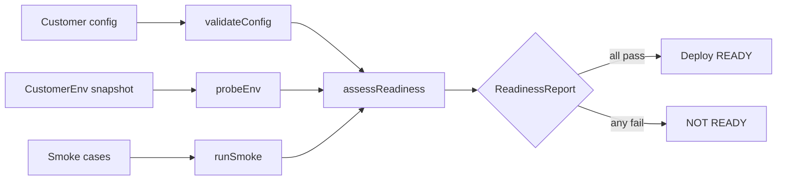

# @aadiaiagent/fde-integration-kit

**Customer-environment / deploy readiness toolkit** — offline config schema checks, environment probes, smoke tests, and a fail-closed deploy-readiness gate.

Zero runtime dependencies beyond the TypeScript toolchain (`typescript`, `vitest`, `tsx`). Node **20+**, ESM, MIT.

Catches the boring failures that kill customer installs — missing config, wrong Node version, empty env vars — before go-live.

---

## Why this exists

Customer installs rarely fail because the demo script looked good. They fail because:

- A required config key was missing or the wrong type
- The runtime Node version was too old
- An env var the adapter depends on was empty in the customer VPC
- A “smoke” assumption (HTTPS URL, timeout range, reachable dependency) was never checked

This kit models the **pre-deploy gate** run in (or against) the customer environment: validate config → probe env → run smoke cases → **assess readiness fail-closed**. No API keys. No network calls. Injectable env so it stays offline and testable.

---

## Architecture



| Module | Role |
|--------|------|
| `validateConfig` | Required keys + primitive types against a simple schema |
| `probeEnv` | Node major + required env vars on an injectable snapshot |
| `runSmoke` | Execute `{name, fn}[]`, capture failures as `CheckResult` |
| `assessReadiness` | Fail-closed gate: pass **iff** every check passed (empty list → not ready) |

---

## Quickstart

```bash
npm install
npm run typecheck
npm test
npm run example
```

Programmatic usage:

```ts
import {
  validateConfig,
  probeEnv,
  runSmoke,
  assessReadiness,
} from "@aadiaiagent/fde-integration-kit";

const configChecks = validateConfig(
  { apiUrl: "https://customer.example/api", timeoutMs: 5000 },
  {
    apiUrl: { type: "string", required: true },
    timeoutMs: { type: "number", required: true },
  },
);

const envChecks = probeEnv(
  { NODE_VERSION: "20.11.0", CUSTOMER_ID: "acme" },
  { requiredVars: ["CUSTOMER_ID"], minNodeMajor: 20 },
);

const smokeChecks = await runSmoke([
  {
    name: "https-only",
    fn: () => {
      /* throw to fail */
    },
  },
]);

const report = assessReadiness([...configChecks, ...envChecks, ...smokeChecks]);
if (!report.pass) {
  console.error("Deploy blocked", report.checks.filter((c) => !c.pass));
  process.exit(1);
}
```

---

## Design choices

| Choice | Rationale |
|--------|-----------|
| **Fail-closed readiness** | Empty or partial check lists must not greenlight a deploy. `assessReadiness([])` → `pass: false`. |
| **Injectable `CustomerEnv`** | Never couple to `process.env` inside the library. Inject a snapshot from the customer host, a secrets manager export, or a test fixture. Offline + hermetic tests. |
| **Offline / no network** | No HTTP clients, no cloud SDKs, no API keys. Safe to run inside air-gapped customer networks. |
| **Zero runtime deps** | Only `typescript` / `vitest` / `tsx` as **dev** tooling. The published surface is plain ESM TypeScript compiled to JS. |
| **Simple schema** | `string` / `number` / `boolean` + `required`. Enough to catch the config mistakes that dominate install tickets; not a JSON Schema clone. |
| **Smoke captures, doesn’t throw** | `runSmoke` turns thrown errors into `CheckResult` so the gate can aggregate config + env + smoke in one report. |

---

## Layout

```
fde-integration-kit/
├── src/
│   ├── types.ts
│   ├── config/validateConfig.ts
│   ├── env/probeEnv.ts
│   ├── smoke/runSmoke.ts
│   ├── readiness/assessReadiness.ts
│   └── index.ts
├── tests/
├── examples/basic.ts
├── .github/workflows/ci.yml
├── package.json
├── tsconfig.json
├── vitest.config.ts
└── LICENSE
```

---

## Scripts

| Script | Purpose |
|--------|---------|
| `npm run build` | Emit `dist/` (NodeNext / ES2022) |
| `npm run typecheck` | Strict `tsc --noEmit` |
| `npm test` | Vitest |
| `npm run example` | Fake customer deploy demo |

---

## Roadmap

- [ ] JSON Schema / Zod adapter (optional peer) for richer config shapes
- [ ] Machine-readable SARIF / JUnit export for CI gates
- [ ] Pluggable smoke transports (still injectable; still default-offline)
- [ ] CLI wrapper (`npx fde-ready --config ./customer.json`)

---

## License

MIT © 2026 [aadiaiagent-max](https://github.com/aadiaiagent-max)
